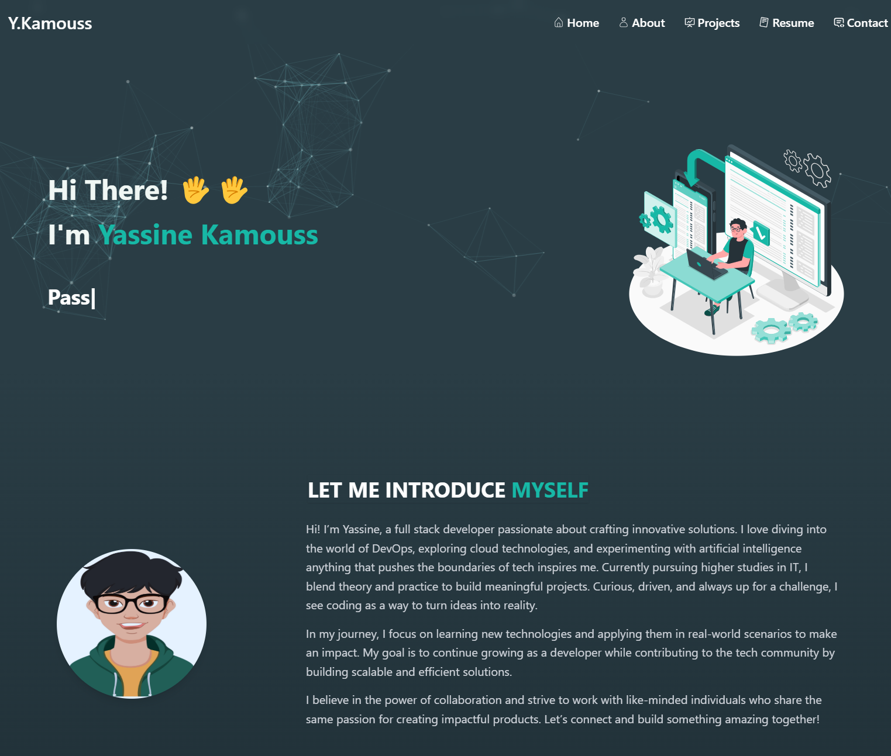

# Portfolio Personnel

This repository hosts my personal portfolio website, designed to showcase my skills, projects, and professional journey. Built with [list technologies, e.g., HTML, CSS, JavaScript, React, etc.], this site serves as a window into my work and creativity.

## Screenshots



## Technologies Used

- React.js
- Additional Libraries/Frameworks : React Router, React Icons, React Typed, React Particle.
- Build Tools : Vite, Webpack.
- CSS : Tailwind, SASS.

## Features

- Responsive interface
- Projects and skills showcase
- Contact form
- Resume/CV section and more

## Live Demo

View the portfolio online : [https://portfolio-yassine-kamouss-projects.vercel.app/](#)

## Local Installation

To run this project locally on your machine :

```bash
# Clone the repository
git clone https://github.com/yassinekamouss/portfolio.git

# Navigate to the project directory
cd portfolio

# Install dependencies
npm install

# Start the development server
npm run dev
```
The site will be accessible at [http://localhost:5173].

## Project Structure

```
src/
├── components/     # Reusable React components
├── assets/         # Images, fonts, and other static resources
├── styles/         # CSS or SCSS files
├── utils/          # Utility functions
└── data/           # JSON data for projects/skills
```

## Deployment

This site is deployed on [Vercel]().

Deployment instructions :

```bash
npm run build
# Commands specific to your deployment platform
```

## Contact

For any inquiries regarding this project, you can [contact me](mailto:yassinekamouss76@gmail.com)